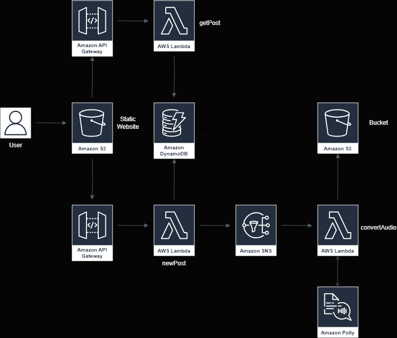

# AWS Text-to-Speech Conversion Application

## Web Application Link
http://ttsbucket444.s3-website.us-east-2.amazonaws.com/

## Demo

## Objective
Convert text posts into MP3 files using AWS services and expose them via RESTful web services.

## Architecture

### Components
- **Amazon S3**: Static web hosting and MP3 storage
- **Amazon API Gateway**: Exposing RESTful services
- **AWS Lambda**: Functions for processing posts
- **Amazon DynamoDB**: Storing post information
- **Amazon SNS**: Decoupling processes
- **Amazon Polly**: Text-to-speech conversion

## Workflow

### Creating a New Post
1. **Static Webpage**: User submits a new post.
2. **API Gateway**: Receives the post data.
3. **New Post Lambda**: Inserts post data into DynamoDB and publishes a message to SNS.
4. **SNS**: Triggers the Convert to Speech Lambda function.
5. **Convert to Speech Lambda**:
   - Retrieves the post from DynamoDB.
   - Converts text to speech using Amazon Polly.
   - Saves the MP3 file to S3.
   - Updates DynamoDB with the S3 URL.

### Retrieving a Post
1. **Static Webpage**: User requests post information.
2. **API Gateway**: Receives the request.
3. **Get Post Lambda**: Retrieves post data from DynamoDB, including the S3 URL.
4. **Response**: Returns the post data and MP3 URL to the user.
